## Skin cancer CLASSIFICATION USING MULTIPROTOTYPE FUZZY LOGIC

---

#### Batch 3 Grp 13 EDI :

- 12011078 - Kuhu Mukhopadhyay
- 12011104 - Tanmay Mutalik
- 12120093 - Vaishnavi Chaudhari
- 12120005 - Ishan Gawali
- 12120160 - Shreyas Manwadkar

---

## About the Dataset:

#### Skin Cancer ISIC:
###### The skin cancer data. Contains 9 classes of skin cancer.

This set consists of 2357 images of malignant and benign oncological diseases, which were formed from The International Skin Imaging Collaboration (ISIC). All images were sorted according to the classification taken with ISIC, and all subsets were divided into the same number of images, with the exception of melanomas and moles, whose images are slightly dominant.

###### The data set contains the following diseases:

> - actinic keratosis
> - basal cell carcinoma
> - dermatofibroma
> - melanoma
> - nevus
> - pigmented benign keratosis
> - -seborrheic keratosis
> - squamous cell carcinoma
> - vascular lesion

##
##
##### Dataset Link:

[Skin Cancer ISIC](https://www.kaggle.com/datasets/nodoubttome/skin-cancer9-classesisic?resource=download)

## About the Project:

#### Problem Statement:

> To classify the input image of skin cancer into the 9 available skin cancer classes using Multiprototype fuzzy logic

#### Dataset Statistics:

**Number of images in each class:**

|           Class            | Total Images | Train Images | Test Images |
|      :-------------:       | :----------: | :----------: | :---------: |
|     Actinic Keratosis      |    130       |     114      |      16     |
|     Basal Cell Carcinoma   |    392       |     376      |      16     |
|     Dermatofibroma         |    111       |     95       |      16     |
|     Melanoma               |    454       |     438      |      16     |
|     Nevus                  |    373       |     357      |      16     |
| Pigmented Benign Keratosis |    478       |     462      |      16     |
|     Seborrheic Keratosis   |    80        |     77       |      3      |
| Squamous Cell Carcinoma    |    197       |     181      |      16     |
|     Vascular Lesion        |    142       |     139      |      3      |
|     Total                  |    2357      |     2239     |      118    |

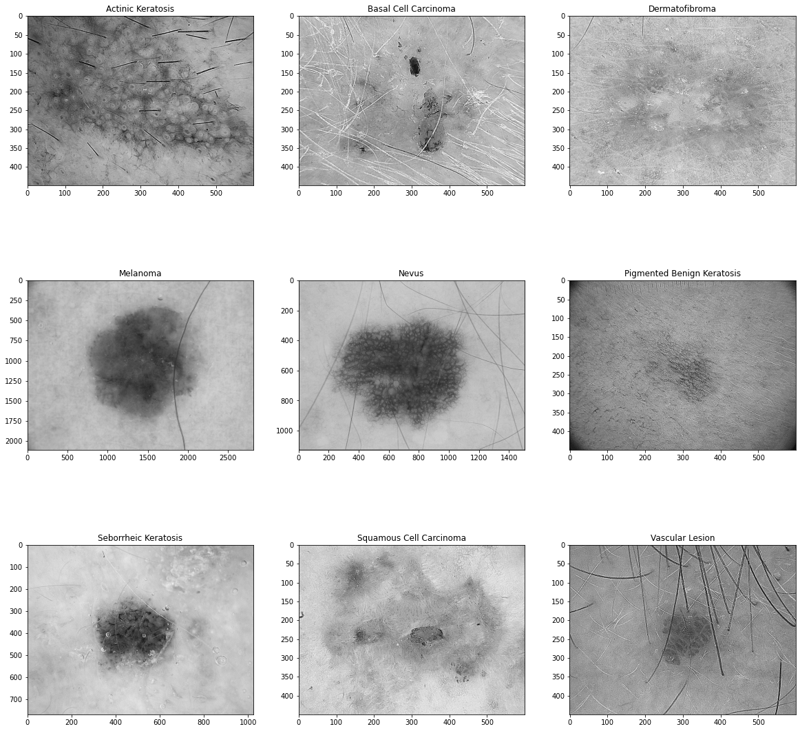

#### Flow chart:

#### Data Preprocessing:

    - The dataset is already divided into two parts: Train and Test each having nine classes as mentioned.
    - The images are first converted to grayscaled images.
    - For testing purpose there are two sets created in order to get better results.
    - Set 1 => Grayscaled images
    - Set 2 => Grayscaled and Sharpened images
    - These images are stored in separate directory.

#### Feature Extraction:

    - The images from set 1 and set 2 are converted to vectors
    - The dimension of this vector is 1 X 256, where value at N'th index represents the frequency of pixel intensity N in the image.
    - These vectors are stored in separate file for further processing.

#### Normalization:
    - These vectors have values between range [0 to 1038507 (set1 - unsharpened)] and [0 to 808611 (set 2 - sharpened)] 
    - The values 1038507 and 808611 are the MAX_VALUE from test and train vectors in respective sets
    - We divide MAX_VALUE with each element at every index in all vectors in train as well as train vectors in respective sets, so that all values get mapped within the range [0 to 1]
    - This reduces the time complexity of the further processing.
    - These normalised vectors are saved in a separate file.

- Normalised vectors of all classes:

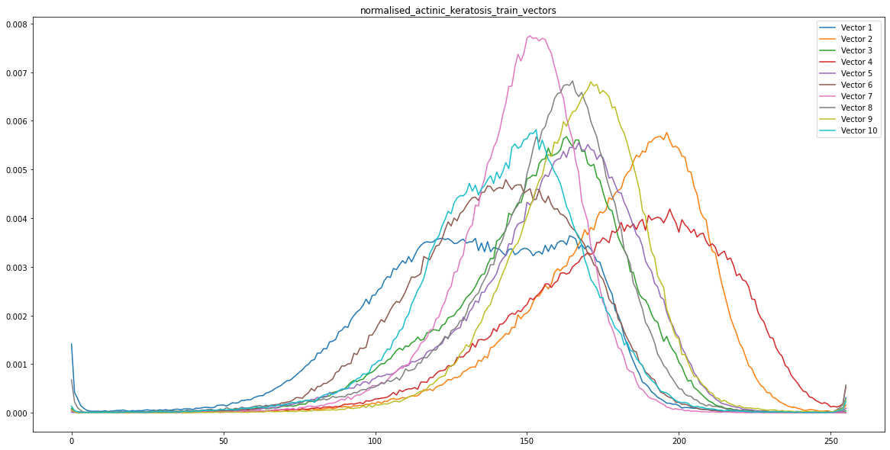
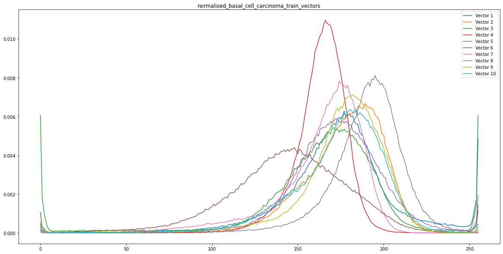
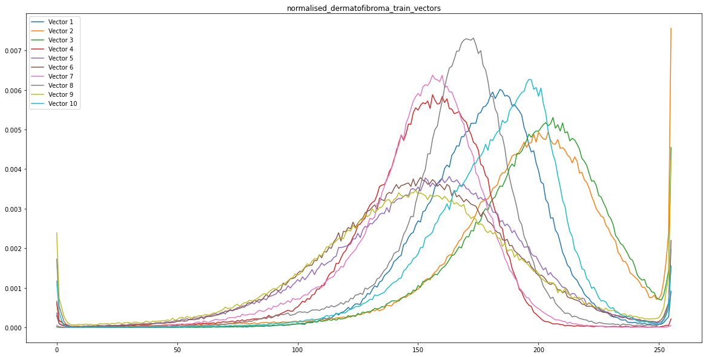
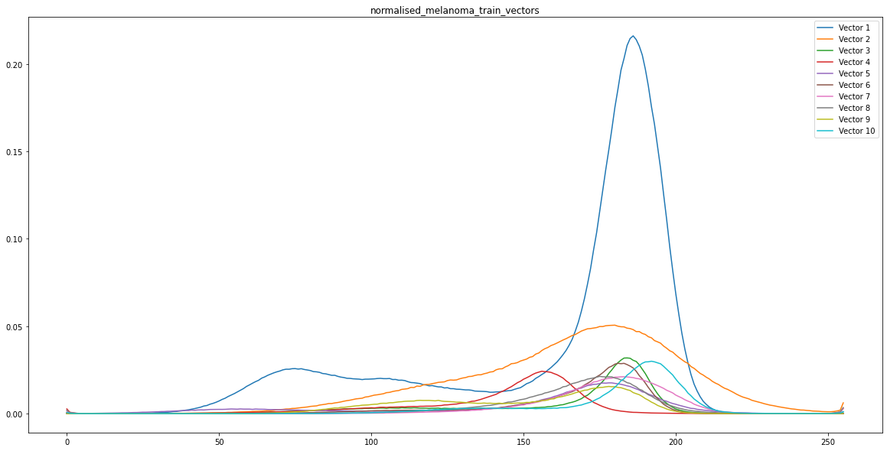
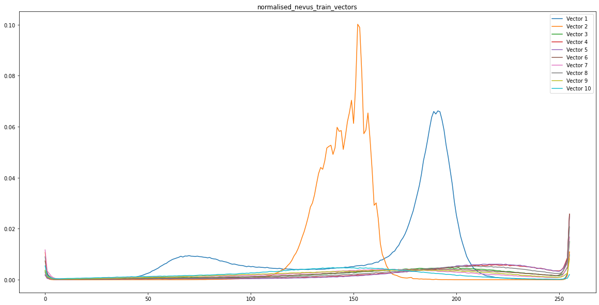
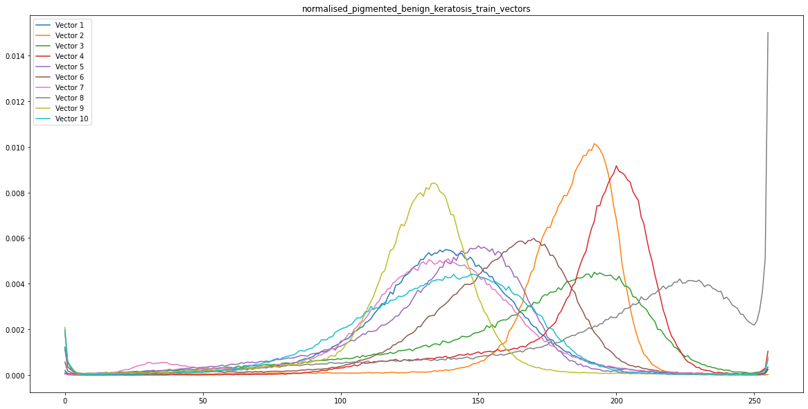
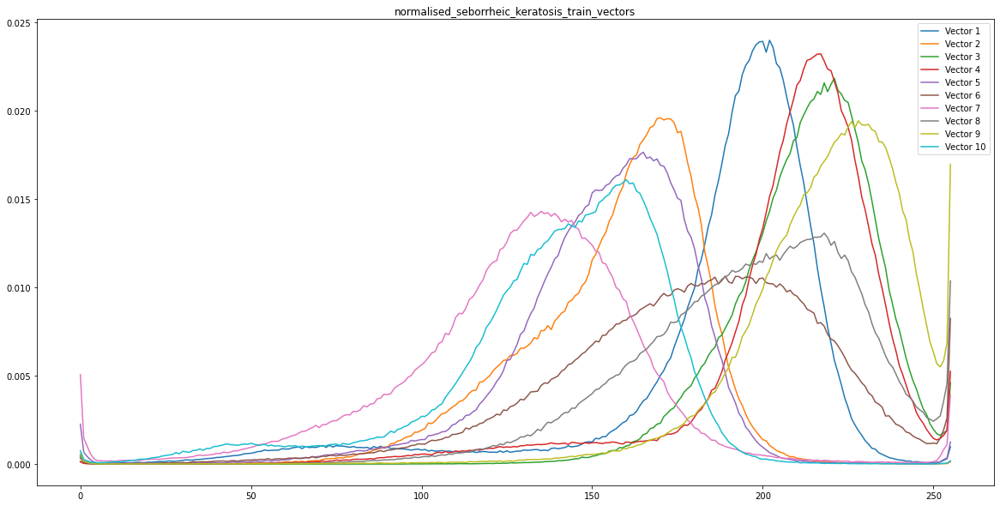
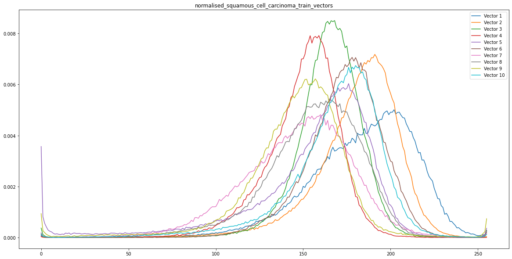
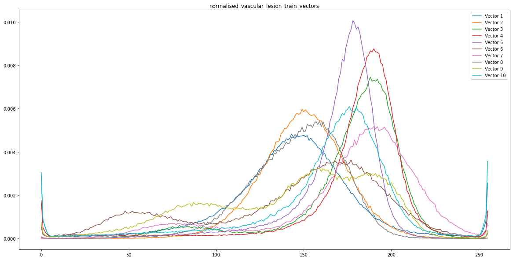

- All vectors in one graph: 
 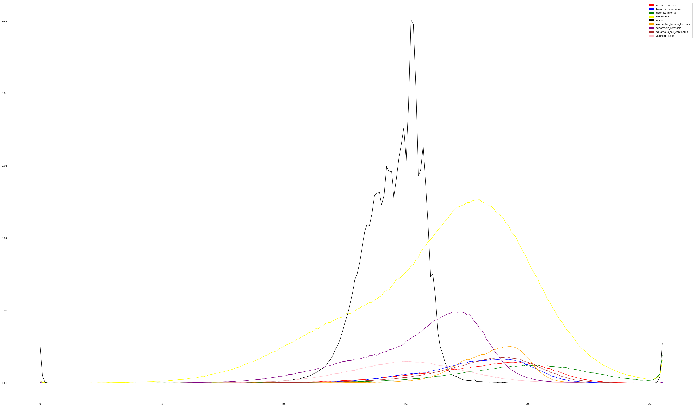

#### Clustering:

    - Clustering the vectors that are within the threshold distance(r) for each class.
    - This process is done only for training vectors
    - The distance between the vectors is calculated using the euclidean distance formula.
$$ \text{Euclidean Distance = } d_{x} = \sqrt{\sum_{i=1}^{n} (x_i - y_i)^2} $$
##### Threshold distance(r):

    - The threshold distance is decided by trial and error method.

<!-- for set 1 -->

----

### Clustering for set 1 (unsharpened images):

----

&nbsp;

|           Class            | Train Images |     r values    | No. of clusters  |
|      :-------------:       | :----------: |    :---------:  | :---------:      |
|     Actinic Keratosis      |     114      |      0.008      |      45          |
|     Basal Cell Carcinoma   |     376      |      0.008      |      162         |
|     Dermatofibroma         |     95       |      0.008      |      64          |    
|     Melanoma               |     438      |      0.05       |      123         |
|     Nevus                  |     357      |      0.05       |      148         |
| Pigmented Benign Keratosis |     462      |      0.008      |      209         |
|     Seborrheic Keratosis   |     77       |      0.05       |      18          |
| Squamous Cell Carcinoma    |     181      |      0.008      |      88          |
|     Vascular Lesion        |     139      |      0.008      |      101         |

e.g. Pigmented Benign Keratosis Clusters

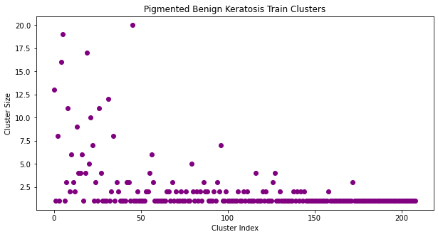

#### Extracting prototypes:

    - Averaging the clusters to get the prototype vectors for each class.
    - Each average vector represents the prototype vector of the respective class.
    - The prototype vectors are used to classify the test images.
    - Number of prototypes are equal to the number of clusters.

&nbsp;

    - Projection of all prototypes of all classes in 3-D

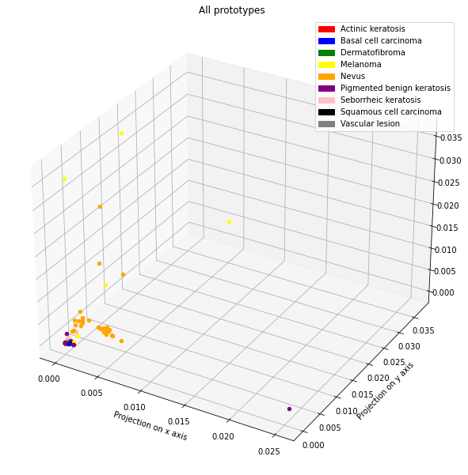

#### Classification:

    - The test vectors are classified into the respective classes using the prototype vectors.
    - The distance between the test image vector and the prototype vectors is calculated using the euclidean distance formula.
    - Each test vector is assigned a degree of membership with respect to each prototype vector.
    - The degree of membership of the test vector with the prototype vector of the respective class is calculated using the following formula:
    &nbsp;

&nbsp;
&nbsp;

- let x be a 256 dimensional test vector
- let y be a 256 dimensional prototype vector

$$ \text{Euclidean Distance = } d_{x} = \sqrt{\sum_{i=1}^{n} (x_i - y_i)^2} $$

&nbsp;

$$ \mu_{x} = \begin{cases} 0 & \text{if } \gamma*d>1 \\ 1 & \text{if } \gamma*d=0 \\ 1 - \gamma*d & \text{if } 0<\gamma*d<1 \end{cases} $$

$$
\text{where,
} \gamma = \text{ sensitivity parameter}
\\
\text{d} = \text{distance between the test vector and the prototype vector}
$$

&nbsp;
&nbsp;
&nbsp;

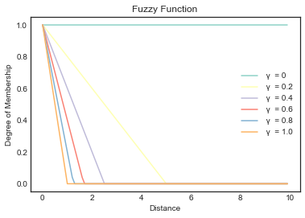

#### Results for set 1:

    - The accuracy of the model is calculated using the following formula:

&nbsp;

$$\text{Accuracy} = \frac{\text{Number of correctly classified test vectors}}{\text{Total number of test vectors}}*100$$
&nbsp;

    - The accuracy of the model is calculated for each sensitivity parameter.
    - The sensitivity parameter that gives the highest accuracy is selected as the optimal sensitivity parameter.
    - The optimal sensitivity parameter is used to classify the test vectors.
    - The accuracy of the model is 88.98% for the optimal sensitivity parameter 0.0005

&nbsp;

###### The confusion matrix for the model is as follows:

&nbsp;

###### The classification report for the model is as follows:

| Class                      | Precision | Recall | F1-Score | Support |
|----------------------------|-----------|--------|----------|---------|
| actinic_keratosis          |   0.94    |  0.94  |   0.94   |   16    |
| basal_cell_carcinoma       |   1.00    |  0.94  |   0.97   |   16    |
| dermatofibroma             |   0.93    |  0.88  |   0.90   |   16    |
| melanoma                   |   1.00    |  0.94  |   0.97   |   16    |
| nevus                      |   0.93    |  0.88  |   0.90   |   16    |
| pigmented_benign_keratosis |   0.82    |  0.88  |   0.85   |   16    |
| seborrheic_keratosis       |   0.50    |  0.67  |   0.57   |    3    |
| squamous_cell_carcinoma    |   0.76    |  0.81  |   0.79   |   16    |
| vascular_lesion            |   0.75    |  1.00  |   0.86   |    3    |
| &nbsp;                     |           |        |          |         |
| accuracy                   |           |        |   0.89   |   118   |
|  macro avg                 |   0.85    |  0.88  |   0.86   |   118   |
|  weighted avg              |   0.90    |  0.89  |   0.89   |   118   |

&nbsp;

<!-- for set 2 -->

----

### Clustering for set 2 (sharpened images):

----

&nbsp;

|           Class            | Train Images |     r values    | No. of clusters  |
|      :-------------:       | :----------: |    :---------:  | :---------:      |
|     Actinic Keratosis      |     114      |      0.008      |      31          |
|     Basal Cell Carcinoma   |     376      |      0.008      |      84          |
|     Dermatofibroma         |     95       |      0.008      |      32          |    
|     Melanoma               |     438      |      0.05       |      114         |
|     Nevus                  |     357      |      0.05       |      128         |
| Pigmented Benign Keratosis |     462      |      0.008      |      97          |
|     Seborrheic Keratosis   |     77       |      0.05       |      15          |
| Squamous Cell Carcinoma    |     181      |      0.008      |      46          |
|     Vascular Lesion        |     139      |      0.008      |      62          |

e.g. Pigmented Benign Keratosis Clusters

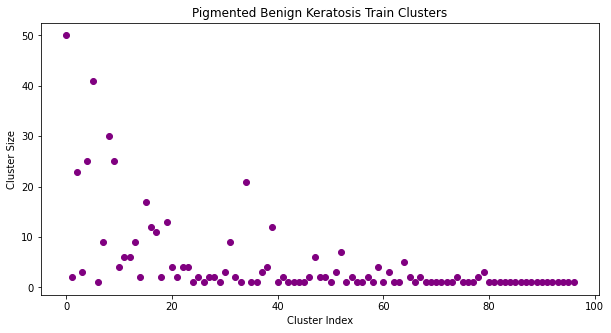

#### Extracting prototypes:

    - Averaging the clusters to get the prototype vectors for each class.
    - Each average vector represents the prototype vector of the respective class.
    - The prototype vectors are used to classify the test images.
    - Number of prototypes are equal to the number of clusters.

&nbsp;

    - Projection of all prototypes of all classes in 3-D

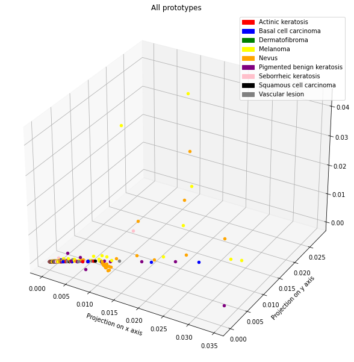

#### Classification:

    - The test vectors are classified into the respective classes using the prototype vectors.
    - The distance between the test image vector and the prototype vectors is calculated using the euclidean distance formula.
    - Each test vector is assigned a degree of membership with respect to each prototype vector.
    - The degree of membership of the test vector with the prototype vector of the respective class is calculated using the following formula:
    &nbsp;

&nbsp;
&nbsp;

- let x be a 256 dimensional test vector
- let y be a 256 dimensional prototype vector

$$ \text{Euclidean Distance = } d_{x} = \sqrt{\sum_{i=1}^{n} (x_i - y_i)^2} $$

&nbsp;

$$ \mu_{x} = \begin{cases} 0 & \text{if } \gamma*d>1 \\ 1 & \text{if } \gamma*d=0 \\ 1 - \gamma*d & \text{if } 0<\gamma*d<1 \end{cases} $$

$$
\text{where,
} \gamma = \text{ sensitivity parameter}
\\
\text{d} = \text{distance between the test vector and the prototype vector}
$$

&nbsp;
&nbsp;
&nbsp;

#### Results for set 2:

    - The accuracy of the model is calculated using the following formula:

&nbsp;

$$\text{Accuracy} = \frac{\text{Number of correctly classified test vectors}}{\text{Total number of test vectors}}*100$$
&nbsp;

    - The accuracy of the model is calculated for each sensitivity parameter.
    - The sensitivity parameter that gives the highest accuracy is selected as the optimal sensitivity parameter.
    - The optimal sensitivity parameter is used to classify the test vectors.
    - The accuracy of the model is 92.37% for the optimal sensitivity parameter 0.0005

&nbsp;

###### The confusion matrix for the model is as follows:

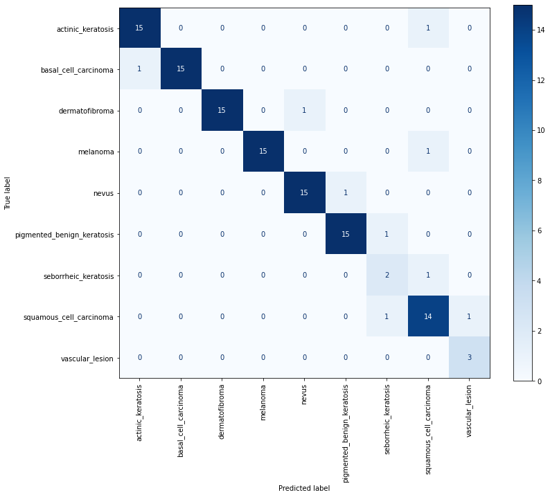

&nbsp;

###### The classification report for the model is as follows:

| Class                      | Precision | Recall | F1-Score | Support |
|----------------------------|-----------|--------|----------|---------|
| actinic_keratosis          |   0.94    |  0.94  |   0.94   |   16    |
| basal_cell_carcinoma       |   1.00    |  0.94  |   0.97   |   16    |
| dermatofibroma             |   1.00    |  0.94  |   0.97   |   16    |
| melanoma                   |   1.00    |  0.94  |   0.97   |   16    |
| nevus                      |   0.94    |  0.94  |   0.94   |   16    |
| pigmented_benign_keratosis |   0.94    |  0.94  |   0.94   |   16    |
| seborrheic_keratosis       |   0.50    |  0.67  |   0.57   |    3    |
| squamous_cell_carcinoma    |   0.82    |  0.88  |   0.85   |   16    |
| vascular_lesion            |   0.75    |  1.00  |   0.86   |    3    |
| &nbsp;                     |           |        |          |         |
| accuracy                   |           |        |   0.92   |   118   |
|  macro avg                 |   0.88    |  0.91  |   0.89   |   118   |
|  weighted avg              |   0.93    |  0.92  |   0.93   |   118   |

&nbsp;

##### Inference:

- The accuracy of the model is **88.98%** for **set 1** & **92.37%** for **set 2** for the optimal sensitivity parameter (**γ**) **0.0005**.

&nbsp;

$$ \text{SET - 1 : for } \gamma = 0.0005  $$

Unsharpened images

|           Class            | Total Images | Train Images | Test Images | Threshold (r) | No. of Prototypes |  Correctly classified images |   Accuracy  |
|      :-------------:       | :----------: | :----------: | :---------: |  :----------: |    :----------:   |           :---------:        | :---------: |
|     Actinic Keratosis      |    130       |     114      |      16     |  0.008        |       45          |              15              |   93.75     |
|     Basal Cell Carcinoma   |    392       |     376      |      16     |  0.008        |       162         |              15              |   93.75     |
|     Dermatofibroma         |    111       |     95       |      16     |  0.008        |       64          |              14              |   87.5      |
|     Melanoma               |    454       |     438      |      16     |  0.05         |       123         |              15              |   93.75     |
|     Nevus                  |    373       |     357      |      16     |  0.05         |       148         |              14              |   87.5      |
| Pigmented Benign Keratosis |    478       |     462      |      16     |  0.008        |       209         |              14              |   87.5      |
|     Seborrheic Keratosis   |    80        |     77       |      3      |  0.05         |       18          |               2              |   66.66     |
| Squamous Cell Carcinoma    |    197       |     181      |      16     |  0.008        |       88          |              13              |   81.25     |
|     Vascular Lesion        |    142       |     139      |      3      |  0.008        |       101         |               3              |   100       |
|     Total                  |    2357      |     2239     |      118    |  0.008        |       958         |             105              |   88.98     |

&nbsp;
$$ \text{SET - 2 : for } \gamma = 0.0005  $$

Sharpened images

|           Class            | Total Images | Train Images | Test Images | Threshold (r) | No. of Prototypes |  Correctly classified images |   Accuracy  |
|      :-------------:       | :----------: | :----------: | :---------: |  :----------: |    :----------:   |           :---------:        | :---------: |
|     Actinic Keratosis      |    130       |     114      |      16     |  0.008        |       31          |              15              |   93.75     |
|     Basal Cell Carcinoma   |    392       |     376      |      16     |  0.008        |       84          |              15              |   93.75     |
|     Dermatofibroma         |    111       |     95       |      16     |  0.008        |       32          |              15              |   87.5      |
|     Melanoma               |    454       |     438      |      16     |  0.05         |       114         |              15              |   93.75     |
|     Nevus                  |    373       |     357      |      16     |  0.05         |       128         |              15              |   87.5      |
| Pigmented Benign Keratosis |    478       |     462      |      16     |  0.008        |       97          |              15              |   87.5      |
|     Seborrheic Keratosis   |    80        |     77       |      3      |  0.05         |       15          |               2              |   66.66     |
| Squamous Cell Carcinoma    |    197       |     181      |      16     |  0.008        |       46          |              14              |   81.25     |
|     Vascular Lesion        |    142       |     139      |      3      |  0.008        |       62          |               3              |   100       |
|     Total                  |    2357      |     2239     |      118    |  0.008        |       609         |             109              |   92.37     |

##### Future Work:

- The model can be improved by using a larger dataset.
- The model can be improved by reducing the threshold value of clustering.
- Images with 3 channels (coloured images) can be used.
- Adjusting the value of γ